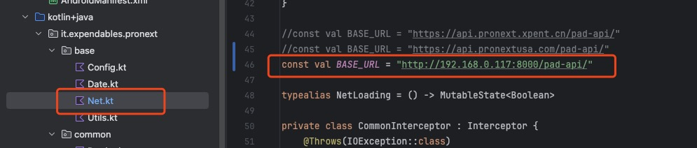
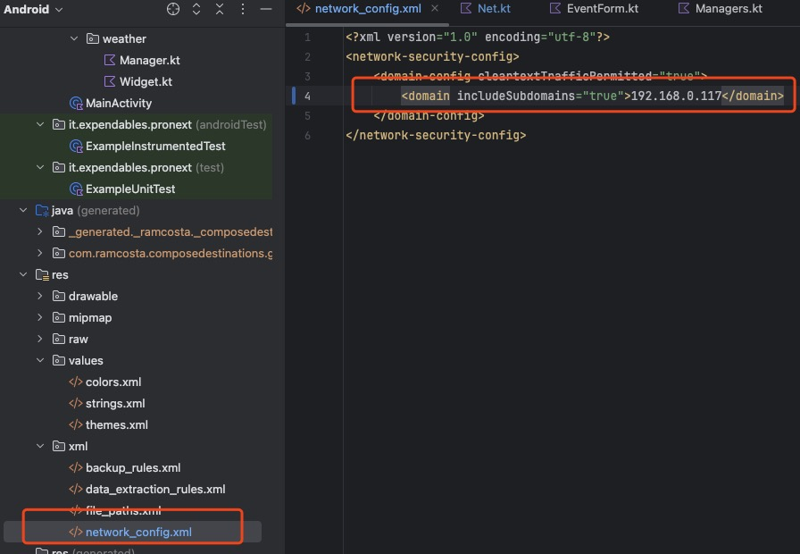
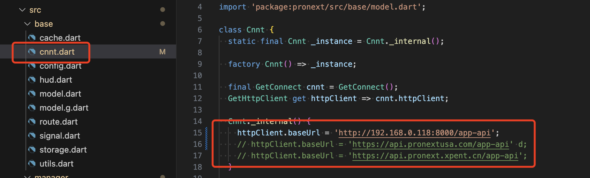
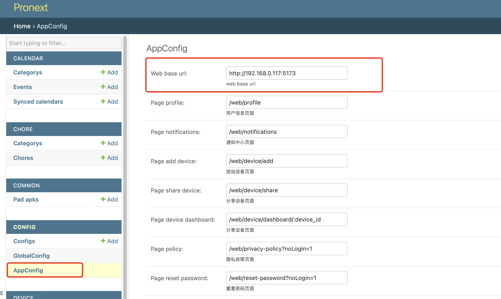
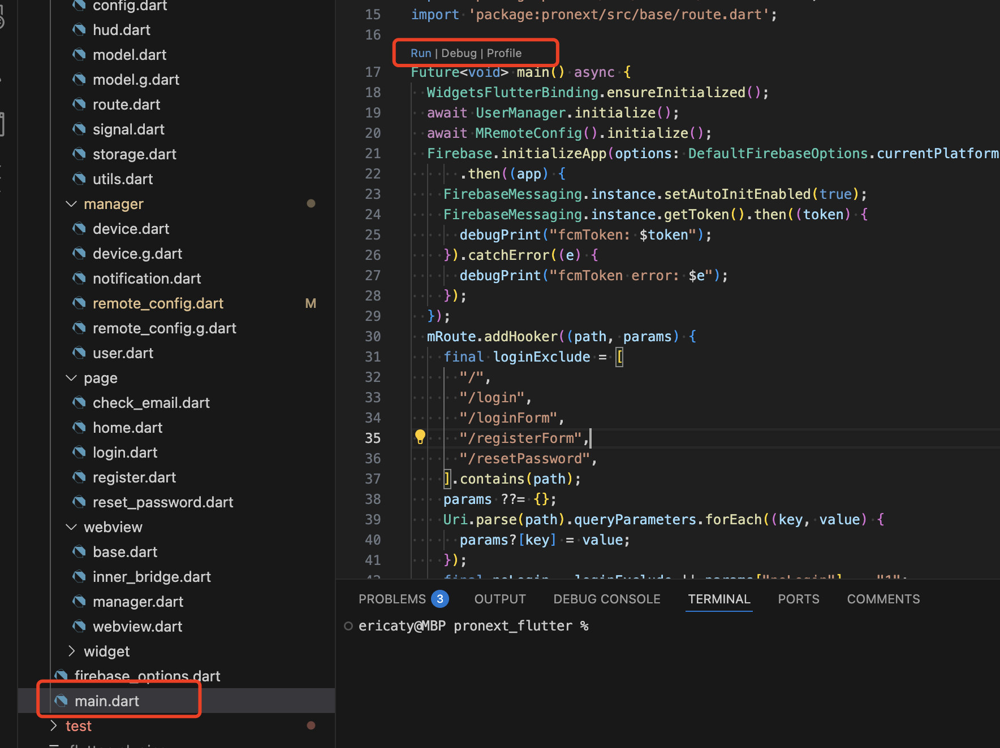
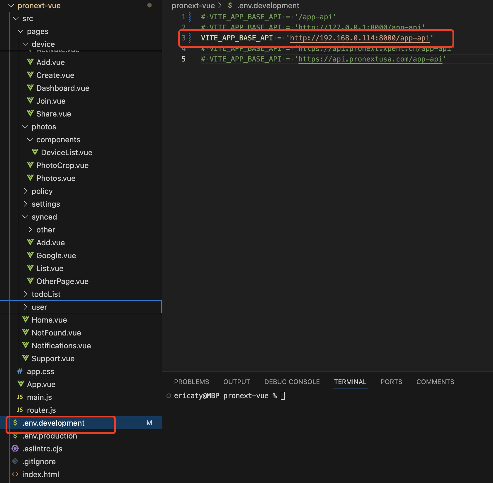

# pronext-calendar-docs

| 仓库名称                  | 介绍                  | 主要语言及框架                        | 说明                                                  |
| --------------------- | --------------------- | ------------------------------------- | ----------------------------------------------------- |
| server        | 日历后端及 API        | Python, Django, RestFramework         |                                                       |
| pad           | 日历 Pad 端           | Android 原生, Kotlin, Jetpack Compose | 模拟器选 Tablet 分辨率 1920\*1080 mdpi                |
| mobile        | 日历 iOS Android 双端 | Flutter, Webview                      | 封装基础 Webview, 提供底层功能, 实现 app 首页用于过审 |
| h5            | 日历 app 端应用层项目 | Vue, vant                             | app 业务功能页面                                      |
| pronext-website       | 官网                  |                                       |                                                       |
| pronext-calendar-docs | api 文档              | MkDocs                                |                                                       |
| cloudflare workers    | 第三方日历同步服务    | NodeJS                                | 两个 scheduler 加一个主服务                           |

## server 开发步骤

1. 安装 python 开发环境

2. 安装 pg12, redis

   创建数据库 pronext

3. 安装依赖

   pip install -r requirements.txt

4. 配置数据库和缓存

   设置 DJANGO_PG 和 DJANGO_REDIS 环境变量:

   DJANGO_PG='pg://postgres:123456@127.0.0.1:5432/pronext'

   DJANGO_REDIS='redis://:qwer1234@127.0.0.1:6379'

   或修改 settings.py:

   default_pg = 'pg://postgres:123456@127.0.0.1:5432/pronext'

   REDIS_URL = env.str('DJANGO_REDIS', 'redis://:123456@127.0.0.1:6379')

5. 迁移数据库

   python manage.py migrate

6. 运行

   python manage.py runserver 0.0.0.0:8000

   运行 celery（只有同步 google token 服务，可以不运行）

   celery -A pronext_server worker -B -l info --scheduler django_celery_beat.schedulers:DatabaseScheduler

## pad 开发步骤

1. 安装 Android Studio

2. 打开项目，自动同步依赖

3. 创建模拟器选 Tablet 分辨率 1920\*1080 mdpi

4. 修改 Net.kt BASE_URL 为本地 server url

   

5. 添加本地 ip 到 network_config.xml

   

6. 选择模拟器，运行项目

## mobile (Flutter) 开发步骤

1. 安装 flutter 开发环境

2. 修改 cnnt.dart httpClient.baseUrl
   

3. server 后端修改 web url 配置为 h5 项目 url

   

4. 运行项目

   

## h5 (Vue) 开发步骤

1. 安装依赖

   npm i

2. 修改.env.development BASE_API 为本地 server url

   

3. 运行项目，在 Flutter 模拟器中看效果

   npm run dev

## cloudflare workers 开发步骤

    复制两个worker pronext-synceder和pronext-sync的代码到本地保存成x.js文件

    加上一行代码运行start函数

        start()

    node x.js
